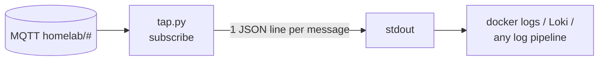

# mqtt-event-tap

A tiny infrastructure service that subscribes to an entire MQTT topic tree
(`homelab/#`) and prints every message as structured JSON logs.

## Why
When I want to know what is actually flowing across the bus, a passive subscriber
is the least invasive way to find out. No publisher and no subscriber has to
change. Point `docker logs`, Loki or whatever log pipeline you run at its stdout,
and the event stream becomes queryable.

## Use
- `tap.py` connects to the broker, subscribes to the configured topic tree, and
  emits one JSON line per message
- Configuration is environment-driven: broker host and port, topic, and
  credentials via a mounted secret file

## Container
- **Hardened**: read-only root filesystem, dropped capabilities,
  `no-new-privileges`, memory-limited (64 MB)
- **Healthcheck**: verifies the broker is reachable over TCP

## Stack
- **Python**, paho-mqtt, Docker

MIT licensed.

## About this snapshot

There is not a lot to strip out of a file this small, but it went through the
same publishing pass as everything else here. Internal addresses become
placeholders, two secret scanners have to pass, and the push is blocked otherwise.

A public history from the first release onwards instead of the real one, which
stays private. The tap runs on my own broker.
