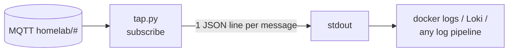

# mqtt-event-tap

A tiny infrastructure service that subscribes to an entire MQTT topic tree
(`homelab/#`) and prints every message as structured JSON logs.

## Why
A passive tap is the simplest way to see what is actually flowing across an event
bus, without touching any publisher or subscriber. Point `docker logs`, Loki or
any log pipeline at it and you get a decoupled, queryable event feed for free.

## Use
- `tap.py` connects to the broker, subscribes to the configured topic tree, and
  emits one JSON line per message
- Configuration is environment-driven: broker host and port, topic, and
  credentials via a mounted secret file

## Container
- **Hardened**: read-only root filesystem, dropped capabilities,
  `no-new-privileges`, memory-limited (64 MB)
- **Healthcheck**: verifies the broker is reachable over TCP

## Stack
- **Python**, paho-mqtt, Docker

MIT licensed.

## About this snapshot

This repository is a curated, secret-free extract from a private source repository.
A script performs the extraction: it drops non-public files, rewrites internal
addresses and paths to placeholders, and requires two independent secret scanners
to pass before anything is pushed.

The development history stays private, which is why you see a single commit here
instead of the real timeline. The code itself is not a demo: it runs in my own
infrastructure and is maintained there.
